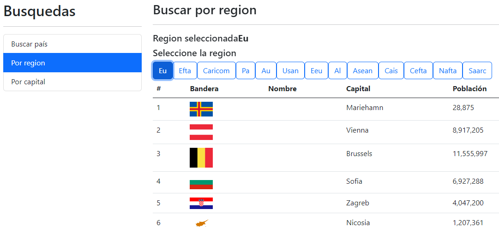

# Proyecto de paises ::: https://dangarduv2.github.io/ProyectoPaises/

----------------------------------------------------------------
## Objetivo
Este es un proyecto que se basa en adquirir experiéncia con Angular
y para que me sirva de portafolio a la hora de buscar trabajo

## Funcionalidades
Es una aplicación WEB que se basa en la API de https://restcountries.com/ para explotar 
su información de paises con siferentes funcionalidades

### :rocket:**Funcionalidad Por-Pais** :rocket:

    ---------------------------------------------------------------------------- 
    > Puedes buscar paises por su nombre (Nombres en inglés | España -> Spain |)
    > Al dejar de escribir por 1 segundo y medio mostrará sugerencias que coincidan con lo escrito
    > En caso de no encontrar ninguna coincidencia, mostrará un mensaje de error que este desaparecerá al tocar alguna tecla y esperar 1 segundo y medio
     ---------------------------------------------------------------------------- 

En caso que no salga el país buscado en las sugerencias puedes dar click en *[Buscar "xxx"]* o enter para buscar todas las coincidencias

*\Caso que no haya coincidencias/*

### :star: **Funcionalidad Por-Región** :star:

    ---------------------------------------------------------------------------- 
    > Teniendo unas regiones ya predefinidas como botones
    > Puedes obtener una lista con los paises pertenecientes a esa región
     ---------------------------------------------------------------------------- 

### :stars: **Funcionalidad Por-Capital** :stars:

    ---------------------------------------------------------------------------- 
    > Es basicamente lo mismo que Por-Paises pero:
       >> Envez de ir por nombre pais, va por nombre de capital
       >> Además No tiene la implementación de sugerencias
     ---------------------------------------------------------------------------- 
